# 52 Card Golf

# Goal for this Project
This project will be a text-based python game where the user has to beat the computer using a little skill but an extraordinary amount of pure luck!! For the user to win the game, they must tactfully swap their cards to create a cumulative score that is lower than the computer.

# Table of Contents
* [UX](#ux "UX")
    * [User Goals](#user-goals "User Goals")
    * [User Stories](#user-stories "User Stories")
    * [Site Owners Goals](#site-owners-goals)
    * [User Requirements and Expectations](#user-requirements-and-expectations)
         * [Requirements](#requirements)
         * [Expectations](#expectations)
     * [Design Choices](#design-choices)
        * [Fonts](#fonts)
        * [Icons](#icons)
        * [Colours](#colours)
        * [Structure](#structure)
    * [Wireframes](#wireframes)
    * [Features](#features)
        * [Existing Features](#existing-features)
        * [Features to be implemented](#features-to-be-implemented)
    * [Technologies used](#technologies-used)
        * [Languages](#languages)
        * [Libraries and Frameworks](#libraries-and-frameworks)
        * [Tools](#tools)
    * [Testing](#testing)
        * [Unfixed Bugs](#unfixed-bugs)
    * [Deployment](#deployment)
    * [Credits](#credits)
# UX

## User Goals
* Selection of cards able to be played with
* Continual score feedback throughout the game
* Know when it is the users go and not
* Clear instruction as to how to play the game
* Know the outcome of the game, win, lose or draw

## User Stories
* As a user, I want to be able to personalise my game
* As a user, I want to select a game type
* As a user, I want to be clearly navigated through the game
* As a user, I want to skip through game instructions if required
* As a user, I want to have continual feedback on my score
* As a user, I want to know the outcome of the game

## Site owners Goals
* Where there is lots of text, present it clearly
* Give the user feedback on performance
* Ensure that there is validation for expected answers on all user inputs
* Create a gently flow of text so the user is able to keep up with reading it

## User Requirements and Expectations

### Requirements
* Single page layout
* Feedback on performance
* Clear instruction as to when the game starts and finishes
* Validation of user inputs
* Feedback to the user on their input to the game

### Expectations
* I expect to know that it is my game based on a username
* I expect to know when the game starts and finishes
* I expect to have the option of reading the rules or not
* I expect not to be able to make any typing errors
* I expect feedback on performance

\
&nbsp;
[Back to Top](#table-of-contents)
\
&nbsp;

## How to Play

* A standard 52 pack of cards is used
    * Ace is 1
    * Jack is 11
    * Queen is 12
    * King is 13
* The user will decide how many cards to be delt (4, 6 or 8)
    * 4 cards selected will play 3 rounds
    * 6 cards selected will play 5 rounds
    * 8 cards selected will play 7 rounds
* The computer will randomly deal then turn the top card of the deck and display it
* The user can elect to swap it for one of their own cards or pass
* After the rounds are completed the game ends
* The winner will have the lowest cumulative score

## Design Choices
### Font

The terminal that was provided by Code Institute to complete this project, used a standard monospace font. In order to keep the theme running through the game, I decided to change the font of the button to the [Courier New](https://en.wikipedia.org/wiki/Courier_(typeface) "Courier New") font. This fits in with the terminal and joins the elements up nicely.

### Colours

The colour scheme is based on the red felt from a poker table. I used  [Colourmind](http://colormind.io/) and initially picked the red that I was looking for. I generated a set of colours, and it created a five colour pallet that can be seen [here](wireframes/generated-colour-scheme.jpg). Colourmind generated an off white that was a perfect contrast match with my red, the results of that can be seen [here](wireframes/contrast-checker.jpg) . My final colour scheme is below.

### Images

I haven't used any images for this game, however, to make the start and end of the game jump out a little more, I used [patorjk.com](https://patorjk.com/software/taag/#p=display&h=1&f=Big&t=52%20Card%20Golf%0A) to create giant text that would appear as an image within the terminal.

\
&nbsp;
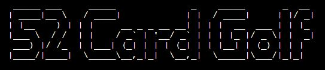
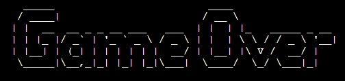

### Structure
The structure of this project has been mapped out using [Lucid](https://lucid.co/ "Lucid"). Using the preformed shapes in [Lucid](https://lucid.co/ "Lucid"), I created my key of shapes.

\
&nbsp;

\
&nbsp;

This then allowed me to walk through the project in my head and work out the links between different parts of the game and then changes depending on user input. I began by working out the flow of the beginning of the game, where the user enters the username and makes a decision on reading the rules, this then dictates their pathway to playing the game.

\
&nbsp;

\
&nbsp;

Once this was completed, I could focus on the game itself. I broke it down into every step I imagined that would be taken to navigate through the game. 

\
&nbsp;

\
&nbsp;

\
&nbsp;
[Back to Top](#table-of-contents)
\
&nbsp;

# Wireframes

The game will be built using a pre-built template that Code Institute has provided. This template already scales down for different screen sizes so I have only produced a desktop wireframe that simply centres the content.

[Desktop Wireframe](wireframes/desktop.jpg "Desktop")

\
&nbsp;
[Back to Top](#table-of-contents)
\
&nbsp;

# Features

## Existing Features

The first feature that is present in the game is the game button. This resets the terminal and the game for the user to play again. The button is very simple in design, there is only an active state attached to it to inform the user when it has been pressed. The text contained in it is clear to the user that it is to be pressed to play again, along with the instruction at the end of the game.

* Start game button

 

* Start game button in an active state

&nbsp;

The game logo follows along with the creator's name. The design of the logo is in clear and easily read text.

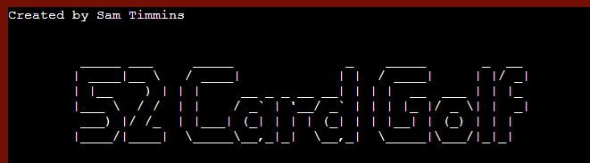

&nbsp;

The previous game statistics inform the user of the last game that was played. The information given is pulled from a Google Sheets document and gives the last players name, the number of cards they played with and their score. Alongside this is information to help the user choose an option that is the most popular game setting.

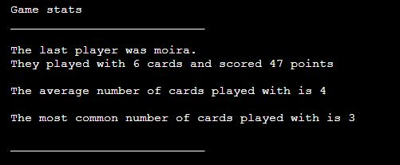

&nbsp;

The user is prompted to enter their name to personalise the game. This is the first instance where validation takes place as there is no way to proceed unless some text is entered. Whitespace does not count and will prompt again for a name to be entered.

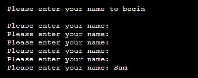

&nbsp;

The first choice by the user is to decide if they would like to read the rules of the game or not. Validation is applied here also where only: yes, y, no or n can be entered in either upper or lower case.

If the user selects yes, the rules are gradually displayed giving the user plenty of time to read them, the game then begins.

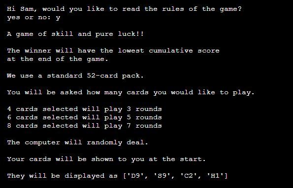

If the user decides that they are happy with the rules, the game skips forward to begin the next feature.

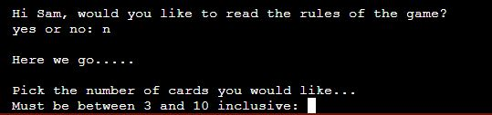

&nbsp;

The game begins properly with the selection of the number of cards the user would like to play with. Validation is applied here so the user can only select a number between 3 and 10 inclusive. anything outside of this will throw the input again. Whitespace on its own, letters and numbers outside of the required range will activate this. When the conditions have been met, the user may then progress.

&nbsp;

The number of rounds is clearly shown to indicate to the user how far they are through the game. A card is picked from the deck and shown to the user, then they are given the option to swap the card or pass their go. there is also validation on the user's input here. The only options are: swap, s, pass or p, these options are not case sensitive either.

If the user decides that they would like to swap one of their cards, they are prompted to select one of their own. The choice is not case sensitive but must match one in their hand. When the card is swapped, the user is then displayed with their game total.

If the user passes, then it moves to the computers move.

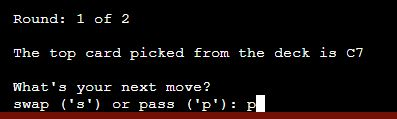

&nbsp;

The computer's move is simply text set at small intervals to give the impression that the user is playing against someone needed thinking time.

&nbsp;

When the rounds have been completed, the user is presented with the game over logo. This logo makes it very obvious that the game has been completed. The added extra of the count down also adds to the user experience of feeling that something is happening behind scenes, adding a small bit of tension. 

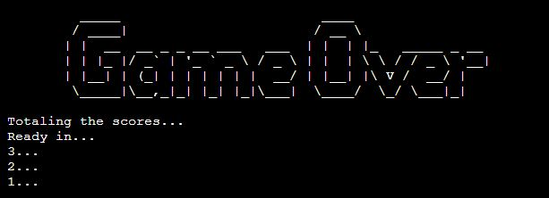

&nbsp;

The results give feedback to the user on their scores and the results. Also, it encourages the user to play again and gives instruction on how to do so.

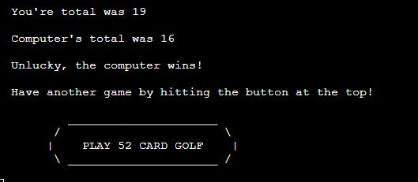

&nbsp;

It is at this point that the Google Sheets document is updated. The user name, the number of cards that they played with and also their score are saved. The entries here feed the game stats at the beginning of a new game.

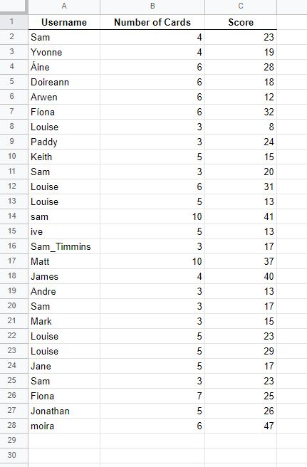

&nbsp;

## Features to be Implemented

\
&nbsp;
[Back to Top](#table-of-contents)
\
&nbsp;

# Technologies used

## Languages
* [HTML](https://en.wikipedia.org/wiki/HTML5 "HTML") for the structure of the site
* [CSS](https://en.wikipedia.org/wiki/CSS "CSS") for the design of the site
* [JavaScript](https://en.wikipedia.org/wiki/JavaScript "JS") was built into the template supplied by Code Institute
* [Python](https://en.wikipedia.org/wiki/Python_(programming_language) "Python") for the game code
* [Markdown](https://en.wikipedia.org/wiki/Markdown) for the content in my README file

## Libraries and Frameworks

* API for Google Sheets [gspread](https://docs.gspread.org/en/v4.0.1/)
* For delying the appearance of the text [python time library](https://docs.gspread.org/en/v4.0.1/ ".py time")
* For selecting a random card from the deck [python random library](https://docs.python.org/3/library/random.html?#module-random ".py random")
* For the games history [python statistics library](https://docs.python.org/3/library/statistics.html?#module-statistics ".py statistics")

## Tools

* For construction [Gitpod](https://www.gitpod.io/ "Gitpod")
* For wireframes [Balsamic](https://balsamiq.com/wireframes/ "Balsamic")
* For python validation [PEP8 online](http://pep8online.com/ "PEP8")
* For HTML validation [W3C HTML Validation Service](https://validator.w3.org/ "W3C HTML")
* For CSS validation [W3C CSS Validation Service](https://jigsaw.w3.org/css-validator/ "W3C CSS")
* For the box shadows [html-css-js.com](https://html-css-js.com/css/generator/box-shadow/ "html-css-js.com")
* For the contract checking [WebAIM](https://webaim.org/resources/contrastchecker/ "WebAIM")
* For general code queries [W3Schools](https://www.w3schools.com/ "W3Schools")
* For python queries [python](https://www.python.org/ "py")
* For the colour pallet [Colourmind](https://colormind.io/ "colourmind")
* For spell checking [Grammarly](https://chrome.google.com/webstore/detail/grammarly-for-chrome/kbfnbcaeplbcioakkpcpgfkobkghlhen/related?hl=en "Grammarly")
* For the API [Google Cloud Platform](https://en.wikipedia.org/wiki/Google_Cloud_Platform "GCP") 
* To hold the completed game data [Google Sheets](https://en.wikipedia.org/wiki/Google_Sheets "Sheets")

\
&nbsp;
[Back to Top](#table-of-contents)
\
&nbsp;

# Testing

I used a wide scope of people to carry out the initial part of my testing.

Initially, I showed them the start of the game and asked them what they thought the game was going to involve or the theme of it. Unanimously the feedback was good, that it was going to be some sort of card game.

I then gave them the simple task of 'Complete the game, playing with 3 cards'. I logged their ability to complete the task and then their feedback.

&nbsp;

| Age | Tech Experience | Task Completed | Comments/ Improvements
| --- | ----------      | -------------  | --------
|  7  | Limited         | Yes            | Red is my favourite colour
| 19  | Advanced        | Yes            | Change the swap and pass to 's' and 'p'
| 39  | Moderate        | Yes            | Make it so I don't have to capitalize my letters
| 42  | Advanced        | Yes            | Show me some game statistics so I can base my game on what others have played
| 76  | Moderate        | Yes            | Space out the rules text to make it easier to read
| 78  | None            | Yes            | I don't like computers, I'm going outside again

&nbsp;

From this testing, I implemented the changes that were recommended as they were all within my capabilities and not time-consuming to achieve.

### UX Testing

| Requirements & Expectations | Implemented | Tested | Comments
| ------------ | ----------- | ------ | --------
|Single page layout | Yes | Yes | Provided by Code Institute template
|Feedback on performance | Yes | Yes | Various feedback depending on the result of the game
| Clear instruction as to when the game starts and finishes | Yes | Yes | Logos and text to define both the beginning and end of the game
|Validation of user inputs| Yes | Yes | Validation on all inputs tailored to suit
| Feedback to the user on their input to the game | Yes | Yes | Continual update to the user on their score and their current hand of cards
| Option of reading the rules or not | Yes | Yes | 

&nbsp;

&nbsp;

| User Goals | Implemented | Tested | Comments
| ------------ | ----------- | ------ | --------
| Selection of cards able to be played with | Yes | Yes | From 3 - 10 cards
| Continual score feedback throughout the game | Yes | Yes | After every user swap round
| Know when it is the users go and not | Yes | Yes | Clear text indication
| Clear instruction as to how to play the game | Yes | Yes | Line spacing and delay printing of text
| Know the outcome of the game, win, lose or draw| Yes | Yes | Displayed at the end of the game

&nbsp;

&nbsp;

| Site Owners Goals | Implemented | Tested | Comments
| ------------ | ----------- | ------ | --------
| Where there is lots of text, present it clearly | Yes | Yes | Line spacing and delay printing of text
| Give the user feedback on performance | Yes | Yes | Displayed at the end of the game
| Ensure that there is validation for expected answers on all user inputs | Yes | Yes | Validation made to suit each user entry
| Create a gentle flow of text so the user can keep up with reading it | Yes | Yes | Line spacing and delay the printing of text

## Code Validation

Using the [PEP8](http://pep8online.com/ "PEP8") code validator for the Python code, I have two errors of trailing whitespace. Both are within my images, where they are needed to prevent a styling issue following a backslash. I decided to leave these errors in as removing them would destroy the look of the game.

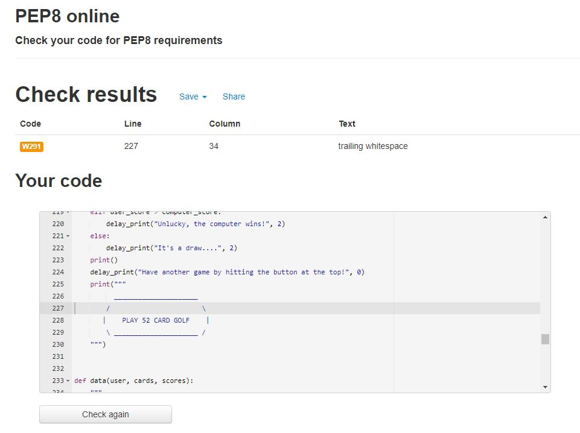

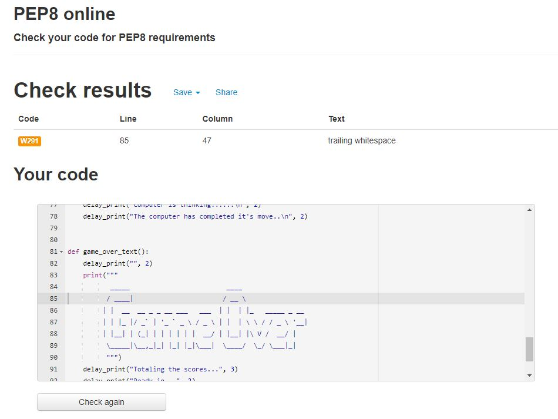

\
&nbsp; 

## Bugs

I had several bugs in the building process, mostly due to the validations of the user's inputs, but a major one also that I had to immediately rectify.

* On my validation of the number of user cards they wish to play with, on my tests, I thought that it was working. However, when I put my project out to the Slack community, Andrew Dempsey managed to find an issue where if the user entered a blank space, it threw up a ValueError. My while statement wasn't thorough enough so I added a strip of the whitespace and then a conversion to an integer for the maths. Again I believed my issue was resolved until I put my project to my 7-year-old daughter. She got to this part of the game and hit the letter 'Q'. I hadn't taken this into consideration and it crashed the game. I adjusted my while loop again with a .isdigit() and this finally completed this part of validation.

* Another issue relating to choosing the number of cards was in the users move function. I spent a very long time trying to work out why I wasn't breaking out of the loop in the select number of cards function and it kept asking me to input 'Must be between 3 and 10 inclusive:'. This should have been a simple fix, as my break was working I had just missed out on a 'return' in the user move function. I wasted a lot of time here, lesson learnt!

* The major issue that I had was again due to a lack of complete understanding of the API process with Heroku. I managed to push my creds.json file to GitHub and caused Google to get in contact with me over a [violation](wireframes/google-violation.jpg "Google Violation"). I rectified this by closing it down and then creating a new API and completing the process correctly.

## Unfixed Bugs

* There are no unfixed bugs

\
&nbsp;
[Back to Top](#table-of-contents)
\
&nbsp;

# Deployment

\
&nbsp;
[Back to Top](#table-of-contents)
\
&nbsp;

# Credits

\
&nbsp;
[Back to Top](#table-of-contents)
\
&nbsp;