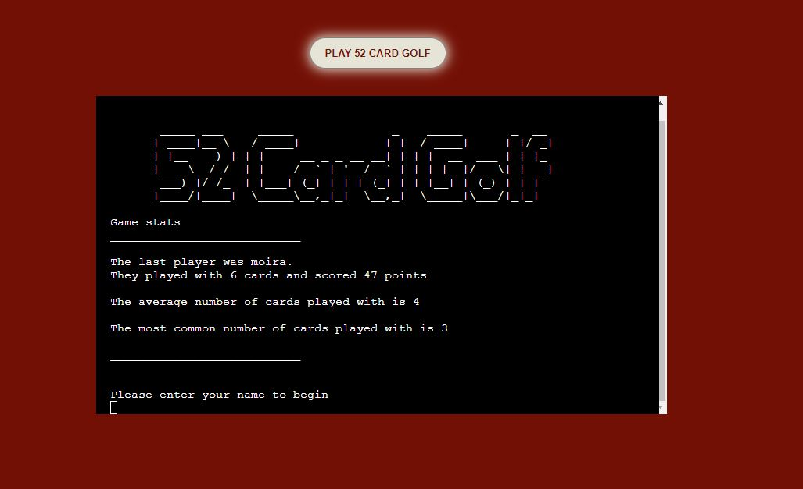
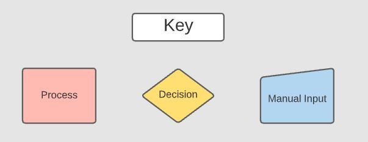
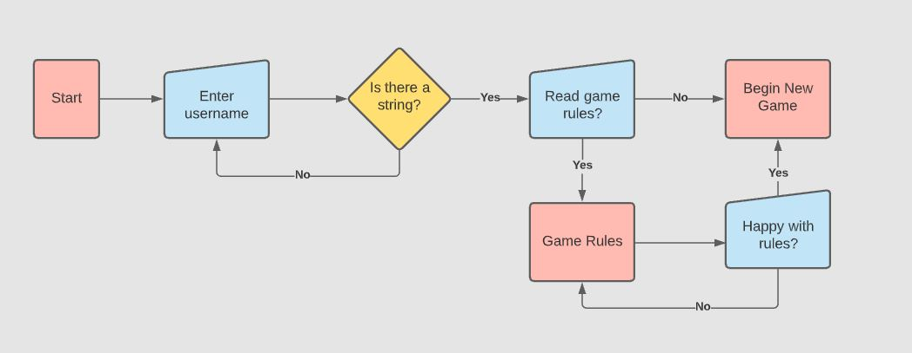
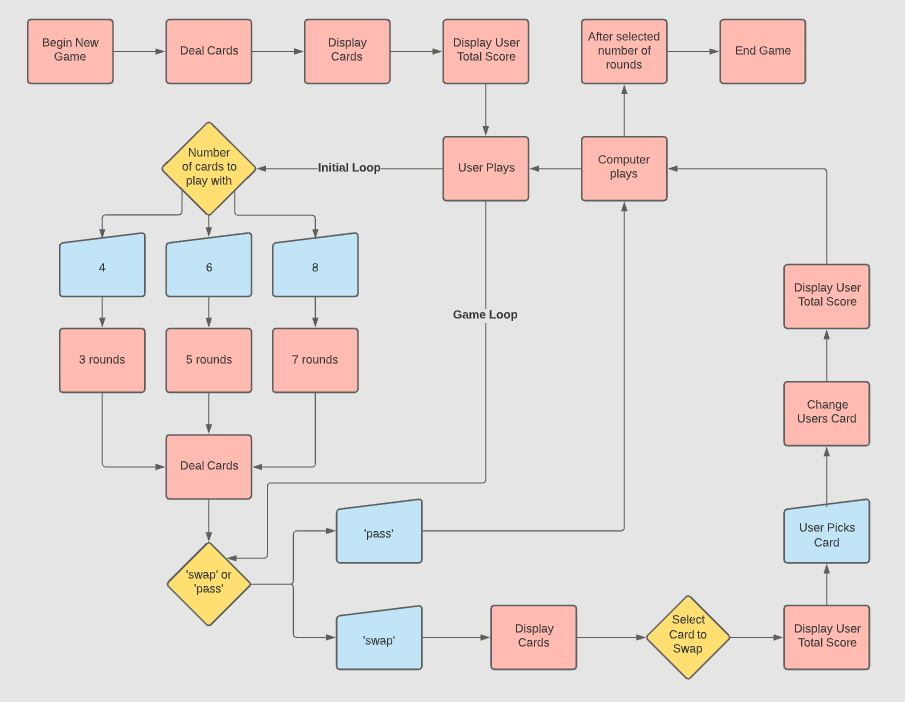

# 52 Card Golf

# Goal for this Project
This project will be a text-based python game where the user has to beat the computer using a little skill but an extraordinary amount of pure luck!! For the user to win the game, they must tactfully swap their cards to create a cumulative score that is lower than the computer.

# Table of Contents
* [UX](#ux "UX")
    * [User Goals](#user-goals "User Goals")
    * [User Stories](#user-stories "User Stories")
    * [Site Owners Goals](#site-owners-goals)
    * [User Requirements and Expectations](#user-requirements-and-expectations)
         * [Requirements](#requirements)
         * [Expectations](#expectations)
     * [Design Choices](#design-choices)
        * [Fonts](#fonts)
        * [Icons](#icons)
        * [Colours](#colours)
        * [Structure](#structure)
    * [Wireframes](#wireframes)
    * [Features](#features)
        * [Existing Features](#existing-features)
        * [Features to be implemented](#features-to-be-implemented)
    * [Technologies used](#technologies-used)
        * [Languages](#languages)
        * [Libraries and Frameworks](#libraries-and-frameworks)
        * [Tools](#tools)
    * [Testing](#testing)
        * [Unfixed Bugs](#unfixed-bugs)
    * [Deployment](#deployment)
    * [Credits](#credits)
# UX

## User Goals
* Selection of cards able to be played with
* Continual score feedback throughout the game
* Know when it is the users go and not
* Clear instruction as to how to play the game
* Know the outcome of the game, win, lose or draw

## User Stories
* As a user, I want to be able to personalise my game
* As a user, I want to select a game type
* As a user, I want to be clearly navigated through the game
* As a user, I want to skip through game instructions if required
* As a user, I want to have continual feedback on my score
* As a user, I want to know the outcome of the game

## Site owners Goals
* Where there is lots of text, present it clearly
* Give the user feedback on performance
* Ensure that there is validation for expected answers on all user inputs
* Create a gently flow of text so the user is able to keep up with reading it

## User Requirements and Expectations

### Requirements
* Single page layout
* Feedback on performance
* Clear instruction as to when the game starts and finishes
* Validation of user inputs
* Feedback to the user on their input to the game

### Expectations
* I expect to know that it is my game based on a username
* I expect to know when the game starts and finishes
* I expect to have the option of reading the rules or not
* I expect not to be able to make any typing errors
* I expect feedback on performance

\
&nbsp;
[Back to Top](#table-of-contents)
\
&nbsp;

## How to Play

* A standard 52 pack of cards is used
    * Ace is 1
    * Jack is 11
    * Queen is 12
    * King is 13
* The user will decide how many cards to be delt (4, 6 or 8)
    * 4 cards selected will play 3 rounds
    * 6 cards selected will play 5 rounds
    * 8 cards selected will play 7 rounds
* The computer will randomly deal then turn the top card of the deck and display it
* The user can elect to swap it for one of their own cards or pass
* After the rounds are completed the game ends
* The winner will have the lowest cumulative score

## Design Choices
### Font
### Colours
### Images

### Structure
The structure of this project has been mapped out using [Lucid](https://lucid.co/ "Lucid"). Using the preformed shapes in [Lucid](https://lucid.co/ "Lucid"), I created my key of shapes.

\
&nbsp;

\
&nbsp;

This then allowed me to walk through the project in my head and work out the links between different parts of the game and then changes depending on user input. I began by working out the flow of the beginning of the game, where the user enters the username and makes a decision on reading the rules, this then dictates their pathway to playing the game.

\
&nbsp;

\
&nbsp;

Once this was completed, I could focus on the game itself. I broke it down into every step I imagined that would be taken to navigate through the game. 

\
&nbsp;

\
&nbsp;

\
&nbsp;
[Back to Top](#table-of-contents)
\
&nbsp;

# Wireframes

The game will be built using a pre-built template that Code Institute has provided. This template already scales down for different screen sizes so I have only produced a desktop wireframe that simply centres the content.

[Desktop Wireframe](wireframes/desktop.jpg "Desktop")

\
&nbsp;
[Back to Top](#table-of-contents)
\
&nbsp;

# Features

## Existing Features

## Features to be Implemented

\
&nbsp;
[Back to Top](#table-of-contents)
\
&nbsp;

# Technologies used

## Languages

## Libraries and Frameworks

## Tools

\
&nbsp;
[Back to Top](#table-of-contents)
\
&nbsp;

# Testing

\
&nbsp;

## Unfixed Bugs

\
&nbsp;
[Back to Top](#table-of-contents)
\
&nbsp;

# Deployment

\
&nbsp;
[Back to Top](#table-of-contents)
\
&nbsp;

# Credits

\
&nbsp;
[Back to Top](#table-of-contents)
\
&nbsp;